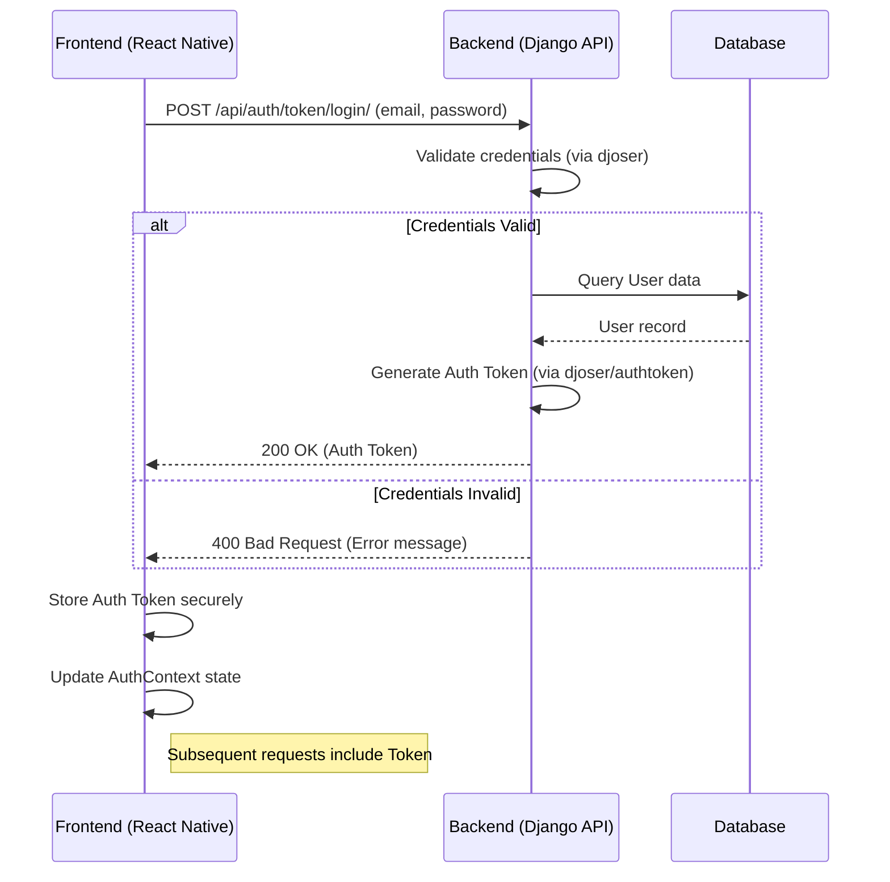

# Backend Implementation Plan for Sille API

## 1. Introduction & Goals

This document outlines the plan for developing the Django backend API (`../SilleBack`) to support the Sille React Native frontend application (`../sillefront`). The goal is to create a robust, scalable API that handles user authentication, product management, shopping cart functionality, subscriptions, orders, user interactions like ratings and favorites, initial user preferences, and personalized perfume match predictions.

## 2. Project Setup Review

*   **Directory:** `../SilleBack`
*   **Virtual Environment:** Assumed active (`venv`)
*   **Python Version:** (Assumed Python 3.x)
*   **Django Version:** (Assumed latest stable)
*   **Django Project Config:** `silleconfig`
*   **Django App(s):** `api` (created and added to `silleconfig.urls`)
*   **Database:** Default SQLite (initial migrations run)
*   **Core Libraries:** Django, Django REST Framework (DRF), django-cors-headers (assumed installed)

## 3. Core App Structure

The primary application logic for the API will reside within the `api` Django app. This includes models, serializers, views, and app-specific URLs.

## 4. Technology Choices

*   **Backend Framework:** Django
*   **API Framework:** Django REST Framework (DRF)
*   **Cross-Origin Resource Sharing:** `django-cors-headers` (configured in `silleconfig/settings.py`)
*   **Authentication:** `djoser` (chosen and implemented in Phase 1) for handling token-based authentication.
*   **Database:** SQLite (for development), PostgreSQL (recommended for production).
*   **ML Prediction Calculation:** To be implemented within Django in a future phase, triggered by survey completion and user ratings.

## 5. Database Schema (Models)

*(Located primarily in `api/models.py`)*

*   **User:** Extend Django's built-in `AbstractUser` to add fields like `phone`, `address` (as seen in `profile-features-plan.md`).
*   **SurveyResponse:** Stores initial user survey answers.
    *   `user` (OneToOneField to User)
    *   `response_data` (JSONField)
    *   `completed_at` (DateTimeField)
*   **Perfume:** Fields for `name`, `brand`, `description`, `notes` (JSONField), `pricePerML`, `thumbnailUrl`, `fullSizeUrl`, `gender`, `occasions` (ManyToManyField to `Occasion`), `accords` (ManyToManyField to `Accord`).
*   **Brand:** Simple model with `name`. (ForeignKey from Perfume)
*   **Occasion:** Simple model with `name`.
*   **Accord:** Simple model with `name`, `description`.
*   **UserPerfumeMatch:** Stores the calculated match percentage between a user and a perfume.
    *   `user` (ForeignKey to User)
    *   `perfume` (ForeignKey to Perfume)
    *   `match_percentage` (DecimalField, max_digits=4, decimal_places=3)
    *   `last_updated` (DateTimeField)
    *   *Meta:* `unique_together = ('user', 'perfume')`
*   **Box:** Abstract base model? Or separate models for `PredefinedBox`, `AIBoxConfig`, `ManualBoxConfig`? Needs further definition. `PredefinedBox` would link to `Perfume` (ManyToManyField).
*   **Cart:** Links to `User` (OneToOne or ForeignKey).
*   **CartItem:** Links to `Cart` (ForeignKey), `Perfume` (ForeignKey), `product_type`, `quantity`, `decant_size`, `price_at_addition`. Potentially JSONField for box config.
*   **Order:** Links to `User` (ForeignKey), stores `total_price`, `status`, `shipping_address`, `order_date`, `payment_details`.
*   **OrderItem:** Links to `Order` (ForeignKey), mirrors `CartItem`.
*   **SubscriptionTier:** Stores `id`, `name`, `price`, `decant_size`, `perfume_criteria`.
*   **UserSubscription:** Links `User` (ForeignKey) to `SubscriptionTier` (ForeignKey), stores `start_date`, `is_active`.
*   **Rating:** Links `User` (ForeignKey) to `Perfume` (ForeignKey), stores `rating` (IntegerField), `timestamp`. (Used as input for ML calculation).
*   **Favorite:** Links `User` (ForeignKey) to `Perfume` (ForeignKey).

**Mermaid ERD Diagram:**

```mermaid
erDiagram
    USER ||--o{ ORDER : places
    USER ||--o{ RATING : gives
    USER ||--o{ FAVORITE : marks
    USER ||--o{ CART : has
    USER ||--o{ USERSUBSCRIPTION : has
    USER ||--|{ SURVEYRESPONSE : completes  // New Relationship
    USER ||--o{ USERPERFUMEMATCH : has_match_for // New Relationship

    PERFUME ||--|{ RATING : receives
    PERFUME ||--|{ FAVORITE : is
    PERFUME ||--|{ CARTITEM : contains
    PERFUME ||--|{ ORDERITEM : contains
    PERFUME ||--o{ PERFUME_OCCASION : has
    PERFUME ||--o{ PERFUME_ACCORD : has
    PERFUME }|--|| BRAND : belongs_to
    PERFUME ||--o{ USERPERFUMEMATCH : has_match_from // New Relationship

    CART ||--|{ CARTITEM : contains
    ORDER ||--|{ ORDERITEM : contains

    OCCASION ||--o{ PERFUME_OCCASION : categorizes
    ACCORD ||--o{ PERFUME_ACCORD : describes

    SUBSCRIPTIONTIER ||--o{ USERSUBSCRIPTION : type_of

    PERFUME_OCCASION {
        int perfume_id FK
        int occasion_id FK
    }
    PERFUME_ACCORD {
        int perfume_id FK
        int accord_id FK
    }

    SURVEYRESPONSE { // New Model
        int user_id PK, FK
        json response_data
        datetime completed_at
    }

    USERPERFUMEMATCH { // New Model
        int user_id FK
        int perfume_id FK
        decimal match_percentage "NN, 0.000-1.000"
        datetime last_updated
    }

    %% Simplified Box Representation (Needs refinement)
    PREDEFINEDBOX ||--o{ PREDEFINEDBOX_PERFUME : contains
    PREDEFINEDBOX_PERFUME {
        int predefinedbox_id FK
        int perfume_id FK
    }
    %% Add relationships for other box types if modeled separately
```

## 6. API Endpoints Design (DRF)

*(Located primarily in `api/views.py` and mapped in `api/urls.py`)*

*   **Authentication (using `djoser`):**
    *   `POST /api/auth/users/` (Register)
    *   `POST /api/auth/token/login/` (Returns auth token)
    *   `POST /api/auth/token/logout/` (Requires token)
    *   `GET /api/auth/users/me/` (Requires token, returns user details)
    *   `PUT/PATCH /api/auth/users/me/` (Requires token, updates user profile)
    *   `POST /api/auth/users/set_password/` (Requires token)
    *   *(Password Reset endpoints provided by djoser)*
*   **Survey (New):**
    *   `POST /api/survey/` (Requires Auth Token): Submits initial survey responses (JSON body). Creates/updates `SurveyResponse` for the user. Triggers initial ML prediction calculation (future).
*   **Perfumes:**
    *   `GET /api/perfumes/` (List/Search/Filter Perfumes. Includes personalized `match_percentage` field [0.000-1.000 or null] for authenticated users).
    *   `GET /api/perfumes/{id}/` (Retrieve Perfume details. Includes personalized `match_percentage` field [0.000-1.000 or null] for authenticated users).
    *   `GET /api/brands/`
    *   `GET /api/occasions/`
    *   `GET /api/accords/`
*   **Boxes:**
    *   `GET /api/boxes/predefined/` (List predefined boxes)
    *   *(Endpoints for AI/Manual box configuration/retrieval - TBD)*
*   **Cart (Requires Auth Token):**
    *   `GET /api/cart/`
    *   `POST /api/cart/items/`
    *   `DELETE /api/cart/items/{item_id}/`
    *   `DELETE /api/cart/`
*   **Subscriptions (Requires Auth Token):**
    *   `GET /api/subscriptions/tiers/`
    *   `GET /api/subscriptions/status/`
    *   `POST /api/subscriptions/subscribe/` (Payment integration later)
    *   `POST /api/subscriptions/unsubscribe/`
*   **Profile (Sub-endpoints covered by Auth/Orders):**
    *   User details: `/api/auth/users/me/`
    *   Password change: `/api/auth/users/set_password/`
    *   Purchases: `/api/orders/`
*   **Ratings & Favorites (Requires Auth Token):**
    *   `GET /api/perfumes/{perfume_id}/rating/` (Get user's rating)
    *   `POST /api/perfumes/{perfume_id}/rating/` (Add/Update rating. Triggers ML prediction recalculation - future).
    *   `GET /api/favorites/` (List favorites)
    *   `POST /api/favorites/` (Add favorite)
    *   `DELETE /api/favorites/{perfume_id}/` (Remove favorite)
*   **Orders (Requires Auth Token):**
    *   `POST /api/orders/` (Create order from cart - payment integration later)
    *   `GET /api/orders/` (List user's orders)
    *   `GET /api/orders/{order_id}/` (Get specific order)

**Mermaid Sequence Diagram (Login Example):**



## 7. Implementation Phases (Priority Order)

1.  **Phase 1: Authentication & Core User Setup (Completed):**
    *   Installed `djoser`, `corsheaders`. Configured settings, URLs.
    *   Extended `User` model.
    *   Ran migrations. Tested core auth endpoints.
2.  **Phase 2: Perfume Catalog API (Partially Completed):**
    *   Defined `Perfume`, `Brand`, `Occasion`, `Accord` models. Ran migrations.
    *   Created basic serializers and read-only ViewSets. Mapped URLs.
    *   **Remaining:** Develop strategy to populate perfume data.
3.  **Phase 3: Survey & Match Percentage Storage:**
    *   Define `SurveyResponse` model. Run migrations.
    *   Create `SurveyResponseSerializer`.
    *   Implement `POST /api/survey/` endpoint view/logic.
    *   Define `UserPerfumeMatch` model. Run migrations.
    *   Modify `PerfumeSerializer` to include personalized `match_percentage` using `SerializerMethodField` (initially returning null).
4.  **Phase 4: Cart API:**
    *   Define `Cart` and `CartItem` models. Run migrations.
    *   Create serializers.
    *   Implement ViewSet/APIViews for cart operations. Requires authentication.
5.  **Phase 5: Box Logic API:**
    *   Define `PredefinedBox` model (and others if needed). Run migrations.
    *   Create serializers.
    *   Implement API endpoint(s) to list/retrieve box details.
    *   Refine `CartItem` model/serializer and cart addition logic for boxes.
6.  **Phase 6: Subscription API:**
    *   Define `SubscriptionTier`, `UserSubscription` models. Run migrations.
    *   Create serializers.
    *   Implement API endpoints (initially without payment). Requires authentication.
7.  **Phase 7: Orders & Checkout API:**
    *   Define `Order`, `OrderItem` models. Run migrations.
    *   Create serializers.
    *   Implement `POST /api/orders/` (initially basic).
    *   Implement endpoints to list/retrieve user orders. Requires authentication.
8.  **Phase 8: Ratings & Favorites API:**
    *   Define `Rating`, `Favorite` models. Run migrations.
    *   Create serializers.
    *   Implement API endpoints. Requires authentication.
9.  **Phase 9 (Future): ML Prediction Calculation Logic:**
    *   Develop the algorithm/logic within Django to calculate `match_percentage`.
    *   Implement triggers to run the calculation after survey completion (`POST /api/survey/`) and after rating submission (`POST /api/perfumes/{perfume_id}/rating/`).
    *   Update `UserPerfumeMatch` records with calculated values.

## 8. Frontend Integration Strategy

*   **Environment Variables:** Store API base URL.
*   **API Client:** Use utility/service for calls.
*   **Authentication:** Integrate `AuthContext.tsx` with backend endpoints. Store/send token.
*   **Survey:** Create UI for the initial survey. On submission, call `POST /api/survey/`.
*   **Data Fetching:** Replace mocks/AsyncStorage with API calls. Handle loading/error states. Display `match_percentage` from perfume data when available.
*   **Data Submission:** Modify functions (`addItemToCart`, `addRating`, etc.) to call backend APIs.

## 9. Testing Strategy

*   **Backend (Django):**
    *   **Unit Tests:** Test models, serializers, ML calculation logic (future).
    *   **API Tests:** Test endpoints (request/response, status codes, auth, personalized `match_percentage` field).
*   **Integration:** Manual testing. Automated E2E tests later.

## 10. Deployment Considerations (Future)

*   **Hosting:** Cloud provider (Heroku, AWS, etc.).
*   **Database:** Switch to PostgreSQL.
*   **Static/Media Files:** Configure serving/storage.
*   **Environment Variables:** Manage secrets.
*   **CORS:** Configure allowed origins for production.
*   **HTTPS:** Enforce HTTPS.